# 🚀 MEAN Stack DevOps Deployment Assignment

## 👤 Candidate Details
**Name:** Deepesh Suthar  
**Email:** deepeshsuthar23@gmail.com  

---

# 📌 Project Overview
This project demonstrates containerization, CI/CD, and cloud deployment of a full-stack MEAN application using:

- MongoDB
- Express.js
- Angular
- Node.js
- Docker
- Docker Compose
- AWS EC2
- Nginx Reverse Proxy
- GitHub Actions (CI/CD)

---

# 🧰 Tools Used
- Git & GitHub
- Docker & Docker Hub
- AWS EC2 (Ubuntu 22.04)
- Nginx
- GitHub Actions

---

# ⚙️ Step 1 — Repository Setup
```bash
git init
git add .
git commit -m "Initial commit"
git branch -M main
git remote add origin https://github.com/deepesh-suthar/mean-devops-assignment.git
git push -u origin main

🐳 Step 2 — Dockerization
Backend Dockerfile

FROM node:18
WORKDIR /app
COPY package*.json ./
RUN npm install
COPY . .
EXPOSE 8080
CMD ["npm", "start"]

Frontend Dockerfile

FROM node:18 as build
WORKDIR /app
COPY package*.json ./
RUN npm install
COPY . .
RUN npm run build

FROM nginx:alpine
COPY --from=build /app/dist /usr/share/nginx/html
EXPOSE 80
CMD ["nginx", "-g", "daemon off;"]

🐳 Step 3 — Docker Compose

version: "3"
services:
  mongodb:
    image: mongo
    container_name: mongodb
    ports:
      - "27017:27017"

  backend:
    build: ./backend
    container_name: backend
    ports:
      - "8080:8080"
    depends_on:
      - mongodb

  frontend:
    build: ./frontend
    container_name: frontend
    ports:
      - "80:80"
    depends_on:
      - backend

🐳 Step 4 — Push Images to Docker Hub

docker tag backend deepeshsuthar/mean-backend
docker tag frontend deepeshsuthar/mean-frontend

docker push deepeshsuthar/mean-backend
docker push deepeshsuthar/mean-frontend


☁️ Step 5 — AWS EC2 Deployment

Install Docker:
sudo apt update
sudo apt install docker.io -y
sudo systemctl start docker
sudo usermod -aG docker ubuntu

Run containers:
docker run -d -p 27017:27017 --name mongodb mongo
docker run -d -p 8080:8080 --name backend --network bridge deepeshsuthar/mean-backend
docker run -d -p 80:80 --name frontend deepeshsuthar/mean-frontend

🌐 Step 6 — Nginx Reverse Proxy
sudo apt install nginx -y
sudo nano /etc/nginx/sites-available/default

server {
    listen 80;

    location / {
        proxy_pass http://localhost:80;
    }

    location /api/ {
        proxy_pass http://localhost:8080/;
    }
}

Resart:
sudo nginx -t
sudo systemctl restart nginx

🔄 Step 7 — CI/CD Pipeline (GitHub Actions)

Secrets added:

DOCKER_USERNAME

DOCKER_PASSWORD

EC2_HOST

EC2_USER

EC2_KEY

Workflow:

name: CI-CD Pipeline

on:
  push:
    branches: ["main"]

jobs:
  build-deploy:
    runs-on: ubuntu-latest

    steps:
    - uses: actions/checkout@v3

    - name: Docker login
      run: echo "${{ secrets.DOCKER_PASSWORD }}" | docker login -u "${{ secrets.DOCKER_USERNAME }}" --password-stdin

    - name: Build images
      run: |
        docker build -t deepeshsuthar/mean-backend ./backend
        docker build -t deepeshsuthar/mean-frontend ./frontend

    - name: Push images
      run: |
        docker push deepeshsuthar/mean-backend
        docker push deepeshsuthar/mean-frontend

    - name: Deploy to EC2
      uses: appleboy/ssh-action@master
      with:
        host: ${{ secrets.EC2_HOST }}
        username: ${{ secrets.EC2_USER }}
        key: ${{ secrets.EC2_KEY }}
        script: |
          docker pull deepeshsuthar/mean-backend
          docker pull deepeshsuthar/mean-frontend
          docker rm -f backend frontend || true
          docker run -d --name backend -p 8080:8080 deepeshsuthar/mean-backend
          docker run -d --name frontend -p 80:80 deepeshsuthar/mean-frontend


🌍 Application Access

Frontend:
👉 http://35.154.53.12

Backend:
👉 http://35.154.53.12/api/tutorials

📸 Screenshots (To Add)

Add screenshots of:

GitHub Actions success
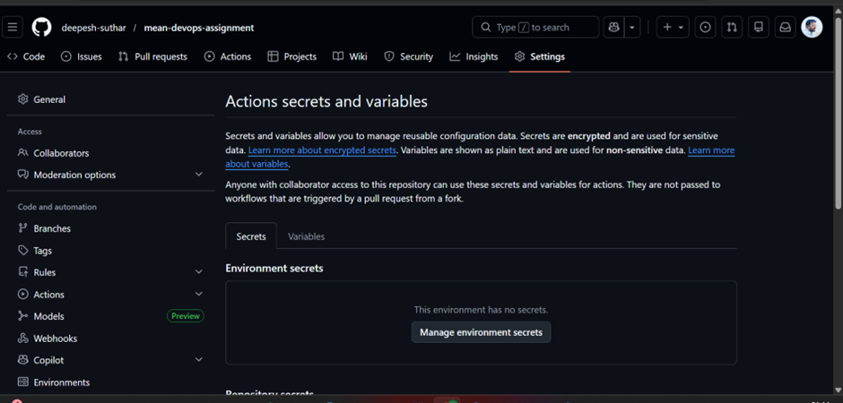
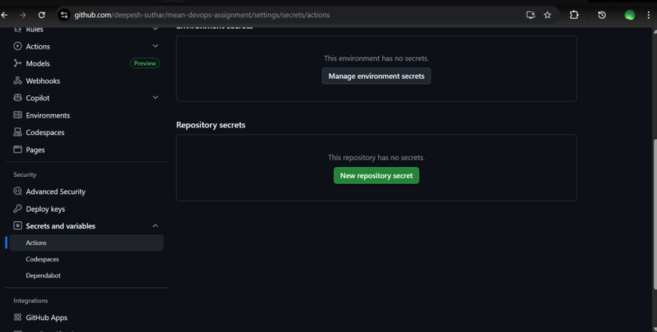
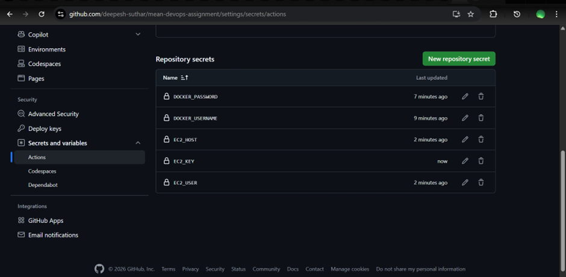

Docker Hub images
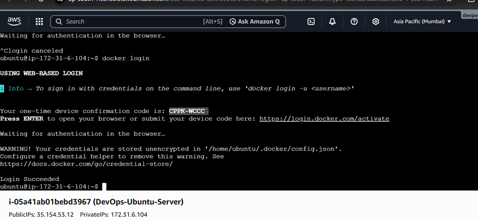


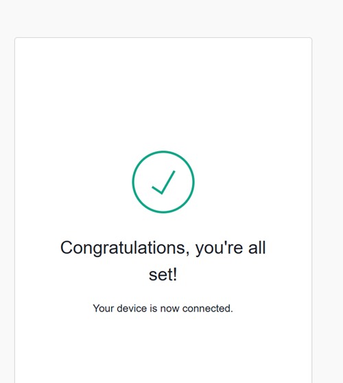


EC2 docker ps
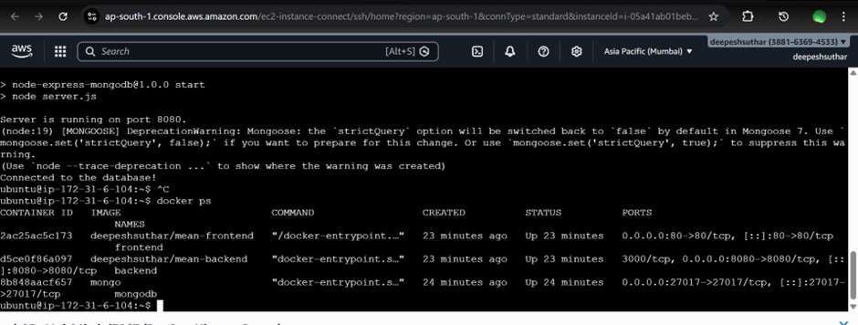


Frontend UI
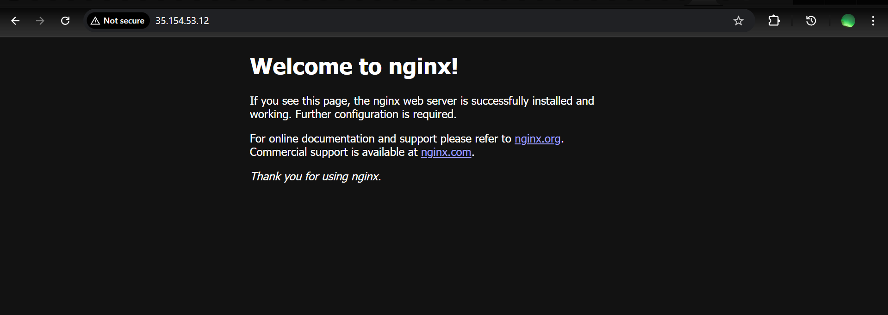


Backend API
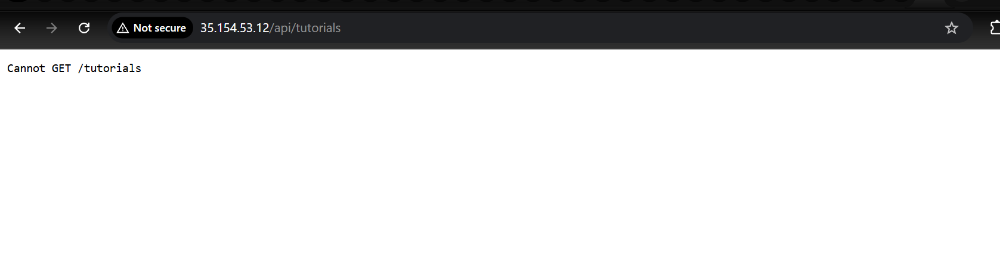


Nginx config
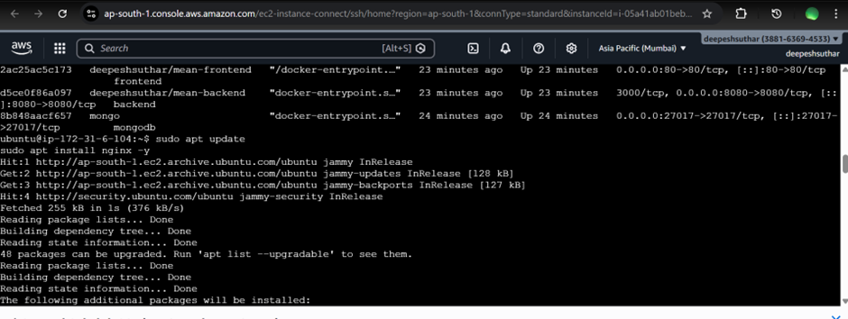
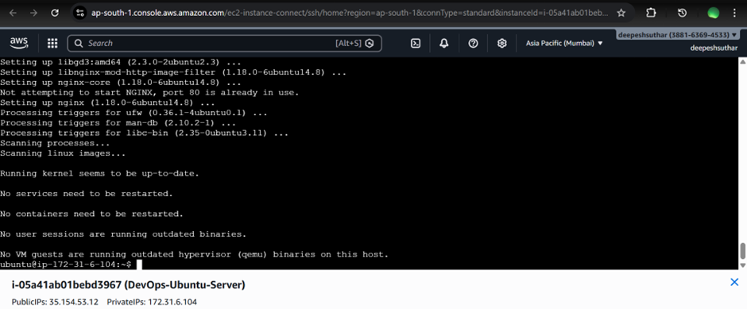
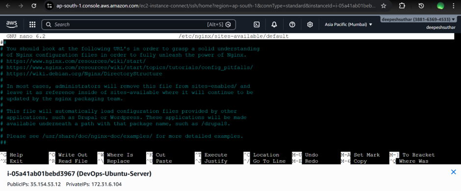

EC2 instance page
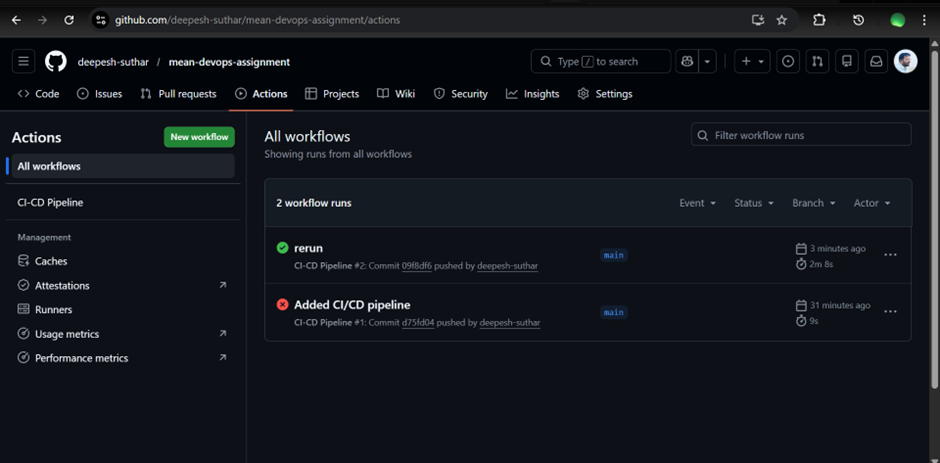
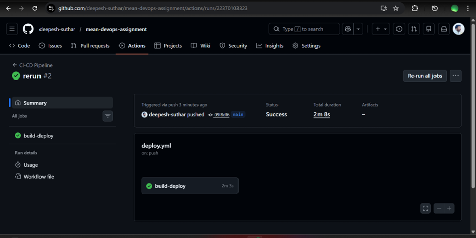


✅ Status

✔ Dockerized
✔ Deployed on AWS
✔ MongoDB connected
✔ Nginx reverse proxy working
✔ CI/CD automated